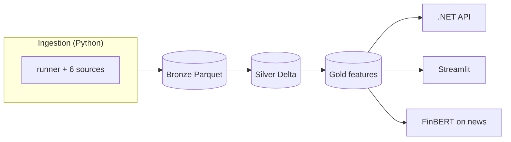

# FinPulse

**Personal lakehouse pipeline:** land financial data in Bronze, clean it in Silver, serve features and NLP from Gold—without one giant mystery table.

[](https://www.python.org/)
[](https://azure.microsoft.com/)
[](./ingestion/tests)
[](https://www.databricks.com/)
[](https://spark.apache.org/)
[](https://dotnet.microsoft.com/)
[](https://streamlit.io/)

I built this because I care about **replayable raw data**, **clear layers**, and **code I can test**—not one-off notebooks that rot.

---

## At a glance

| | |
|--|--|
| **Last full run** | **19,985** rows · **6** sources · **6** Bronze Parquet files |
| **Tests** | **107** (`ingestion/tests`) |
| **Ingestion** | `python -m ingestion.runner` · `--dry-run` skips Azure |

---

## Why it exists

Markets, macro, filings, and headlines all arrive differently. FinPulse keeps **raw history** (Bronze), **shared cleaning rules** (Silver), and **curated outputs** (Gold) separate—so I can fix Silver without pretending Bronze never happened.

---

## Medallion in one picture



| Layer | What lives here | Status |
|-------|-----------------|--------|
| **Bronze** | Raw Parquet in Azure · `{source}/{date}/*_raw.parquet` | **Live** |
| **Silver** | Typed, conformed Delta | Next |
| **Gold** | Facts, aggregates, NLP features | Next |

---

## Stack — what each thing does

| Tech | Job |
|------|-----|
| **Python** | Ingestion, tests, glue |
| **Azure Blob** | Real Bronze storage (not a fake folder) |
| **Parquet / PyArrow** | Columnar raw files → Spark-ready |
| **pytest** | Sources + runner mocked for HTTP/Azure |
| **Databricks + PySpark + Delta** | Silver/Gold transforms (planned) |
| **.NET API** | Thin serving layer off Gold—batch stays Python |
| **Streamlit** | Fast exploration / demos (planned) |
| **FinBERT** | Finance-tuned sentiment on **headlines I already ingest** (planned) |
| **Airflow (Docker)** | DAGs as code, cheap iteration; **same mental model as ADF**, without Azure orchestration bills while I build |

---

## Data flow (six sources → runner → Bronze)

`yfinance` → `fred` → `alphavantage` → `newsdata` → `rss` → `edgar`

One failure doesn’t kill the run; you get a **summary table** (OK / FAILED + rows or error) and a non-zero exit if anything broke.

---

## Repo layout

```
finpulse/
├── ingestion/
│   ├── runner.py
│   ├── sources/          # 6 modules
│   └── tests/            # 107 tests
├── docs/specs/
├── api/                  # .NET — planned
├── dashboard/            # Streamlit — planned
├── pipeline/             # Databricks — planned
├── orchestration/        # Airflow — planned
├── requirements.txt
└── pytest.ini
```

---

## Run locally

```bash
python -m venv .venv
# Windows: .\.venv\Scripts\activate   |  Unix: source .venv/bin/activate
pip install -r requirements.txt
# Add .env (Azure + keys — see CONTEXT.md)
python -m ingestion.runner              # full write
python -m ingestion.runner --dry-run    # fetch only
python -m pytest ingestion/tests -v
```

---

## Built vs next

| Done | Coming |
|------|--------|
| 6 sources + sequential runner + dry-run | Silver notebooks (Databricks) |
| Bronze Parquet to Azure | Gold marts + FinBERT features |
| 107 tests | ASP.NET API · Streamlit · Airflow DAGs |

---

## Decisions (short)

- **.NET API** — Decouple online reads from Spark/Python batch; stable HTTP contract.
- **FinBERT** — Real NLP on **my** news Bronze, not a random sentiment demo.
- **Airflow vs ADF** — Code-first DAGs locally first; ADF when I need enterprise scheduling in Azure—not a different architecture, just a different operator.
